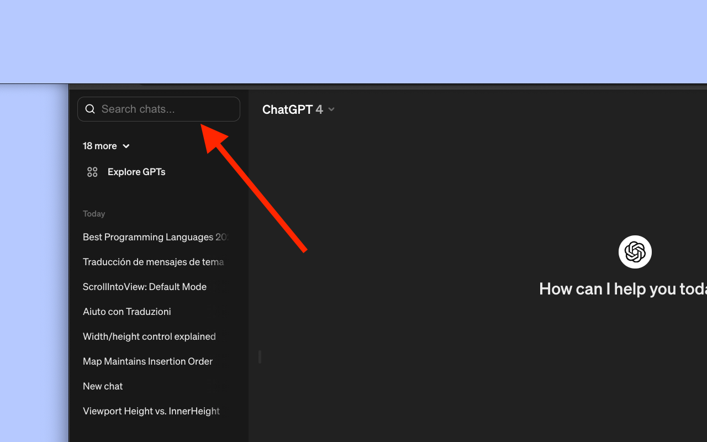

# GPT Search 

## Install on [Chrome](https://chromewebstore.google.com/detail/gpt-search/glhkbfoibolghhfikadjikgfmaknpelb), [Firefox](https://addons.mozilla.org/en-US/firefox/addon/gpt-search), or [Edge](https://microsoftedge.microsoft.com/addons/detail/gpt-search/hcnfioacjbamffbgigbjpdlflnlpaole). 

## Main features
1. Search through your conversation history. 
2. Beautifully integrated into ChatGPT's UI. 
3. Blazingly fast after initial caching. 
4. [Advanced search](./advancedSearch.md)

